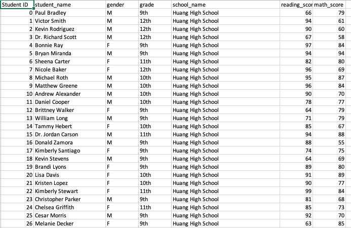
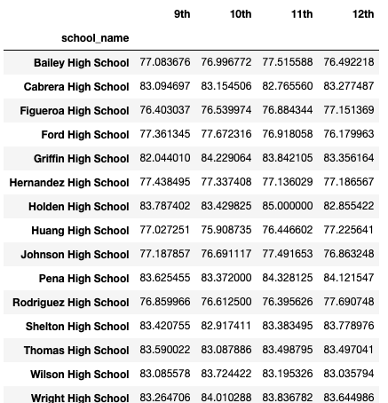

# pandas
Large data set of grades, students, and budgets spanning 15 schools analytically explored through Pandas' DataFrame capabilities. Passing rate is  defined as having a score that is equal to or greater than 70. Education is essential, and having the analytical skills to see what is occurring within institutions is invaluable. 

## Getting Started
### Installing
1) Git clone the repository to your local machine:
    ````
    $ git clone https://github.com/markgat/pandas.git
    ````
## Running
1) Create a terminal within the directory of the local repository, and enter the command ````$ jupyter notebook```` with a "y".
2) When the new page loads, locate ````school_analysis.ipynb```` within Panda->PyCitySchools and open it
3) From here, you can run the blocks one-by-one by selecting the first block and clicking "Run" on top, for each cell, to see the process of analytics, or selecting "Cells" from the top bar and then "Run All" to see it execute all at once.
4) To shutdown, select "Quit" on Jupyter directory webpage.
## Data Preview
### Source Data: Schools
CSV record of 15 schools listing its ID, name, whether it is a district or charter school, the size/population of the institute, and overall budget.


### Source Data: Students
CSV with a record of 39,170 students. Each student has their listed ID, name, gender, grade, school name, reading score, and math score.


### Output: Merged Student and Schools CSVs
Initial data manipulation is a merge of both CSVs by joining relevant school information to the corresponding student.


### Output: Short Overall Summary
A very brief, holistic summary to quickly assess performance of all the students by average scores and percentages. This is prefixed by a total count of schools, students, and dollars in budget to give a sense of scale for the data. 


### Output: Merged CSVs Organized by School
An overall summary organized by the 15 individual schools, and their students' performances by averages. Total school budget and its derived individual student budget, total school budget, total student count, and type of school are also included in order to give context to the averages and schools.


### Output: Schools Ranked from Best Performing Students to Worst
Contains the same data as the previous table, but ranked from the greatest to least percentage of overall passing rate. Of course, passing rates can be an indicator of either capable students, great teaching, and/or an easy curriculum. Further analysis and more data would be required to solidify any hypotheses.


### Output: Student Average Math Scores by Grade
All 15 schools are individually listed with students' average scores per grade. Analyzing  this way can check to see consistency of school curriculum across grades, influence by grade/age in performance, as well as viewing student performance based on general curriculum difficulty between schools for math.


### Output: Student Average Reading Scores by Grade
All 15 schools are individually listed with students' average scores per grade. Analyzing  this way can check to see consistency of school curriculum across grades, influence by grade/age in performance, as well as viewing student performance based on general curriculum difficulty between schools for reading.


### Output: General Student Performance by Spending Range/Budget
Dividing a school's budget by the number of students, we get an estimate of the minimum spending of students. The spending ranges are then tied to the averages of math and reading scores/passing rates. What is very evident with this data is that there is a gradual decline in scores and passing percentage as a student spends more. The greatest decline being within the percentage of students passing math.


### Output: General Student Performance by School Size
Averages of math and reading scores/passing rates calculated by the size of each school's population. With an increase in size is a general decline in students' scores and passing percentage. What is interesting is that although the average scores were lower in medium sized schools compared to small schools, the passing percentage for both subjects increased which meant student grades were lower, but were more centralized above the score of 70. 

